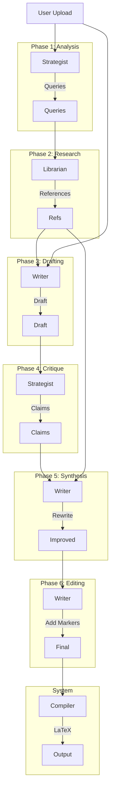

# Architecture & Pipeline Reference

## The 6-Phase "Research-First" Pipeline

### Phase 1: THE STRATEGIST (Analysis)

**Agent:** Strategist Agent
**Purpose:** Analyze the input text and define the research strategy.
**Behavior:** Generates targeted `Research Queries` to find evidence *before* drafting begins.
**Output:** A list of keywords and search terms.

### Phase 2: THE LIBRARIAN (Research)

**Agent:** Librarian Agent
**Purpose:** Gather verified empirical evidence.
**Behavior:** Searches online databases to find real, peer-reviewed papers for each query. Verifies existence and **extracts source URLs** for the bibliography.
**Output:** A catalog of `References` (Author, Title, Year, URL).

### Phase 3: THE THINKER (Drafting)

**Agent:** Writer Agent
**Purpose:** Draft the paper with full awareness of available evidence.
**Behavior:** Writes the content, structuring arguments around the known evidence from Phase 2. Generates `enhancements` (diagrams, tables) within strict limits (20 for Standard, Unlimited for Advanced). **Streams progress** via real-time word count updates.
**Output:** Draft JSON (No in-text citations yet).

### Phase 4: THE PEER REVIEWER (Critique)

**Agent:** Librarian Agent (Senior PI Role)
**Purpose:** Conduct a "Nature/Science" caliber review (Verification + Novelty + Rigor).
**Behavior:** Verifies claims against evidence, audits for logical flow, and assesses novelty/significance.
**Output:** A structured `ReviewReport` (Supported, Unverified, Novelty Check, Critique).

### Phase 5: THE REWRITER (Synthesis)

**Agent:** Writer Agent
**Purpose:** Integrate evidence naturally into the prose.
**Behavior:** Rewrites sentences to weave the research findings into the narrative (e.g., "As Smith (2023) argues...").
**Output:** Improved Draft (integrated ideas, no markers yet).

### Phase 6: THE EDITOR (Citation)

**Agent:** Writer Agent
**Purpose:** Format citations for the compiler.
**Behavior:** Inserts `(ref_X)` markers into the text. These markers map to the cataloged references.
**Output:** Final Draft with citation markers.

---

## Agent Mapping (BYOK)

The system is designed around "Bring Your Own Key" (BYOK) with three distinct agent roles:

1. **Writer Agent:**
   
   * **Role:** Drafting (Phase 3), Rewriting (Phase 5), Editing (Phase 6).
   * **Recommended Models:** Claude 3.5 Sonnet, GPT-4o.
   * **Capabilities:** High reasoning, long context, excellent writing style.

2. **Strategist Agent:**
   
   * **Role:** Analysis (Phase 1).
   * **Recommended Models:** o1-preview, Claude 3.5 Sonnet.
   * **Capabilities:** Logic, planning, skepticism.

3. **Librarian Agent:**
   
   * **Role:** Research (Phase 2), Peer Review (Phase 4).
   * **Recommended Models:** Perplexity, Gemini 2.5 (via Poe).
   * **Capabilities:** **MUST** have internet access (for Research and Novelty checks).

---

## Data Flow

---

## Key Principles

### 1. Research-First Architecture

We do not ask the AI to "write and cite" simultaneously. We find the evidence *first*, then ask the AI to write a paper *about* that evidence. This eliminates the primary cause of LLM hallucinations.

### 2. Deterministic Bibliography

The bibliography is constructed programmatically from the `Librarian`'s results. The LLM never writes the `\bibliography` section, ensuring perfect formatting.

### 3. Custom Preview Architecture ("The Independent Option")

We have abandoned third-party rendering libraries (`latex.js`) in favor of a **Custom TypeScript Orchestrator** (`client/src/lib/latex-unifier/processor.ts`).
-   **Chassis**: A recursive "SaaS" parser for general structure (Sections, Environments).
-   **Sanitization Layer**: Aggressive Preamble Stripping (removing `\usepackage`) to prevent macro crashes.
-   **Engines**: Specialized renderers for complex content:
    -   **TikZ**: `tikz-engine.ts` (Iframe Isolation + Intent Engine).
    -   **Math**: `math-engine.ts` (KaTeX for all equation types).
    -   **Tables**: `table-engine.ts` (Manual Character-Walker Parsers).
    -   **Citations**: `citation-engine.ts` (IEEE Standard).

### 4. Intent-Based Diagrams

TikZ diagrams are scaled dynamically based on the AI's *intent* (deduced from `node distance` and text density), ensuring both compact pipelines and large cycles render correctly.

### 5. Transparency Over Perfection

- If no evidence is found for a claim, we do not fake it.
- Activity logs show every step: "Drafting section...", "Identifying claim...", "Researching...".
- **Fault Tolerance**: The previewer follows the "Show Something" rule. Malformed LaTeX is rendered as best-effort text or raw code, never crashing the UI.

### 6. Zero Hallucinations

- The Bibliography is constructed deterministically from the Librarian's findings.
- The Writer is strictly forbidden from inventing citations.

### 7. The Gospel Rule (Tool Safety)

- **NEVER** use `replace_file_content` or `multi_replace_file_content`.
- **ALWAYS** use `write_to_file` to rewrite the entire file content when making changes.
- **Reason:** To prevent file corruption and "hallucinated" code states.

### 8. The "Code is Law" Rule (Parser Independence)

- **NEVER** rely on external libraries for critical path rendering if they are unstable.
- **Strict Containment** (Legacy Concept) has been replaced by **Full Ownership** (Independent Model). We own the parser, so we control the errors.
  1. **Math**: Must use KaTeX.
  2. **TikZ**: Must use Iframe Isolation.
  3. **Tables**: Must use Custom HTML Parser.
  4. **Algorithms**: Must use Custom HTML Parser.
  5. **Enumerate**: Must use Custom HTML Parser (Leaf-First Recursion).
  6. **Citations**: Must use Custom Parser.

### 9. Universal Citation Processor (v1.5.13)
-   **Robust Tokenizer**: Captures citation blocks `(ref_...)` and **parses** them by splitting on any separator (comma, space, semicolon).
-   **Systemic Merger**: Recursively merges adjacent citations `[1][2]` -> `[1, 2]`.
-   **Format**: Mainstream Formal Academic (IEEE/Nature).
-   **Implementation**:
  -   **Server**: Two-pass Parser logic in `latexGenerator.ts`.
  -   **Client**: Custom grouper `[${validNums.join(', ')}]` for preview.

### 10. Synchronous Rendering Stability (v1.6.0)
-   **No Timers**: `setTimeout` is strictly forbidden for core rendering logic (`render`, `scaling`, `layout`).
-   **Event Loop**: DOM measurements must use `requestAnimationFrame` to guarantee execution *after* the browser paint cycle, eliminating race conditions.
-   **Pipeline**: The new `convertLatexToHtml` parser is fully synchronous string-processing.

### 11. Robust Manual Parsing (The "Scorched Earth" Policy)
-   **Regex Forbidden**: For nested or recursive structures (Lists, Tables, Parboxes), Regex is strictly forbidden.
-   **Character Walkers**: We use manual state-machine parsers/character-walkers that track brace depth and escape characters.
-   **Reason**: To guarantee 100% no-fallback rendering for complex user input (e.g., code blocks inside lists, or escaped ampersands in tables).

### 12. Local-First Architecture (v1.7.0)
-   **No Remote Servers**: The entire application runs locally on the user's machine. There is no "our servers".
-   **External Calls**: Only LLM API calls leave the machine (to OpenAI, Anthropic, Poe, etc.).
-   **Fully Offline Option**: Users can configure Ollama (local LLM) for complete offline operation.
-   **Data Privacy**: API keys are stored in browser localStorage, never transmitted to any server except the configured AI providers.

### 13. Plain Text URL Protocol (v1.9.50)
- **Mechanism**: URLs in bibliographies are rendered as `\url{...}` -> `<code>` (Plain Text), strictly on a new line.
- **Reasoning**: Academic papers are static documents. Clickable links are visual pollution and imply web-navigation, which contradicts the "printable paper" ethos.
- **Implementation**: Regex replacement in `processor.ts` converts `\url` to non-clickable HTML.

---

## Client-Side Routing (v1.7.0)

| Route | Component | Purpose |
|-------|-----------|---------|
| `/` | `LandingPage` | Upload zone, file staging, job configuration |
| `/config` | `ConfigPage` | AI provider configuration (responsive accordion layout) |
| `/processing/:id` | `ProcessingPage` | Live progress console during AI processing |
| `/result/:id` | `ResultPage` | LaTeX preview with download options |
