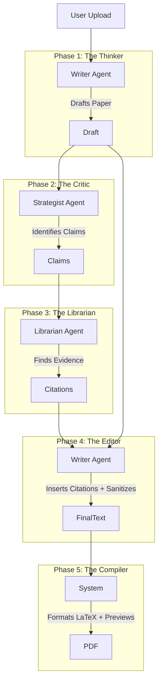

<!-- GOSPEL RULE: NEVER USE replace_file_content OR multi_replace_file_content. THESE TOOLS ARE BROKEN AND WILL CORRUPT FILES. ALWAYS USE write_to_file FOR ALL EDITS. THIS RULE MUST NEVER BE REMOVED. -->
# System Architecture: Auto Academic Paper

## Overview

The **Auto Academic Paper** system uses a **human-like 5-phase research workflow** that mirrors how real academic researchers write papers: draft first, identify claims needing evidence, research specific claims, then insert citations. This pipeline is executed by three configurable AI agents (BYOK).

## The 5-Phase "Human-Like" Pipeline

### Phase 1: THE THINKER (Drafting)
**Agent:** Writer Agent
**Purpose:** Draft the complete paper based on the user's prompt and uploaded content.
**Behavior:** Generates a JSON object with a `sections` array (content) and a separate `enhancements` array (diagrams, tables, etc.). **NO CITATIONS.**
**Output:** Draft JSON with placeholders for enhancements.

### Phase 2: THE CRITIC (Verification Planning)
**Agent:** Strategist Agent
**Purpose:** Review the draft and identify specific claims that require empirical evidence.
**Behavior:** Acts as a skeptical reviewer. "This claim needs a source."
**Output:** A list of specific claims and search queries.

### Phase 3: THE LIBRARIAN (Research)
**Agent:** Librarian Agent
**Purpose:** Find real, verified academic papers for the identified claims.
**Behavior:** Searches online databases (via Poe, Perplexity, etc.) to find matching evidence.
**Output:** Verified citations and snippets.

### Phase 4: THE EDITOR (Synthesis & Sanitization)
**Agent:** Writer Agent
**Purpose:** Insert the verified citations into the original draft and sanitize output.
**Behavior:** 
1.  **INSERT ONLY:** Strictly preserves the original text and appends citation keys `(ref_X)` to sentences. Does NOT rewrite.
2.  **SERVER-SIDE SANITIZATION:** Runs `sanitizeLatexOutput` to strip dangerous characters (e.g., invalid unicode in math mode) and enforce safety before JSON parsing.
**Output:** Sanitized, cited draft.

### Phase 5: THE COMPILER (Formatting & Preview)
**Agent:** System (Internal)
**Purpose:** Generate the final LaTeX document and provide a robust browser preview.
**Behavior:** 
1.  **LaTeX Generation:** Deterministic formatting. No AI hallucination allowed here.
2.  **Browser Preview:** Uses `LatexPreview.tsx` with a **Robust Sanitization Layer**:
    *   **TikZ:** Rendered via isolated iframes (TikZJax).
    *   **Math:** Rendered via KaTeX (display mode) or LaTeX.js (inline).
    *   **Unsupported Features:** (e.g., `tabularx`, `forest`) are displayed as "Raw Code Blocks" to preserve transparency.
**Output:** Final PDF/LaTeX and Interactive Preview.

---

## Agent Mapping (BYOK)

The system is designed around "Bring Your Own Key" (BYOK) with three distinct agent roles:

1.  **Writer Agent:**
    *   **Role:** Drafting and Editing.
    *   **Recommended Models:** Claude 3.5 Sonnet, GPT-4o.
    *   **Capabilities:** High reasoning, long context, excellent writing style.

2.  **Strategist Agent:**
    *   **Role:** Critical analysis and planning.
    *   **Recommended Models:** Can use the same model as Writer, or a specialized reasoning model (o1-preview).
    *   **Capabilities:** Logic, skepticism, instruction following.

3.  **Librarian Agent:**
    *   **Role:** Online Research.
    *   **Recommended Models:** Perplexity, Gemini 2.5 (via Poe), or any model with web search tools.
    *   **Capabilities:** **MUST** have internet access.

---

## Data Flow

---

## Key Principles

### 1. Intent-Driven Research
Research is driven by **what we want to say**, not by pre-gathered resources. We draft first, then verify.

### 2. Transparency Over Perfection
- If no evidence is found for a claim, we do not fake it.
- Activity logs show every step: "Drafting section...", "Identifying claim...", "Researching...".
- **Preview Transparency:** Unsupported LaTeX features are shown as raw code blocks, not hidden or broken.

### 3. Zero Hallucinations
- The Bibliography is constructed deterministically from the Librarian's findings.
- The Writer is strictly forbidden from inventing citations.

### 4. The Gospel Rule (Tool Safety)
- **NEVER** use `replace_file_content` or `multi_replace_file_content`.
- **ALWAYS** use `write_to_file` to rewrite the entire file content when making changes.
- **Reason:** To prevent file corruption and "hallucinated" code states.

---

## Technical Implementation

-   **Backend:** Node.js / Express
-   **AI Service:** `server/ai/service.ts` orchestrates the pipeline.
-   **Streaming:** Real-time progress updates via `onProgress` callbacks and throttled logging.
-   **Resilience:** 
    -   **Timeouts:** 3-minute timeout for critical AI steps (Critic).
    -   **Retries:** Automatic retries for failed API calls.
    -   **Throttling:** Log updates are throttled to prevent CPU spikes.
-   **Sanitization:**
    -   **Server:** `sanitizeLatexOutput` in `server/ai/utils.ts`.
    -   **Client:** `sanitizeLatexForBrowser` in `client/src/components/LatexPreview.tsx`.

---

*Last Updated: 2025-12-02*
*Version: 3.1 (Stable - Sanitization & Safety Protocols)*
