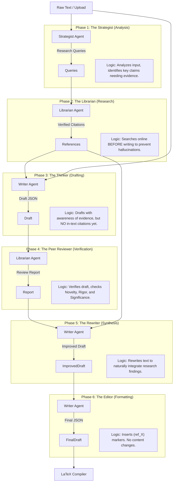

# Content Generation Pipeline Documentation

## 1. Overview

The **Auto Academic Paper** system employs a deterministic, 6-phase "**Research-First**" pipeline to transform raw input documents into rigorous academic papers. This pipeline is orchestrated by `server/ai/service.ts` and uses a "Bring Your Own Key" (BYOK) architecture with three distinct agent roles: **Strategist**, **Librarian**, and **Writer**.

## 2. Architecture & Data Flow

The pipeline operates sequentially, passing a shared `PipelineContext` object between phases.



---

## 3. Detailed Phase Logic & Prompts

### Phase 1: The Strategist (Analysis)
**Agent:** Strategist
**Input:** Raw content.
**Output:** List of `Research Queries`.
**Logic:**
1.  **Analysis:** Analyzes the input text to identify the core thesis and maintain arguments.
2.  **Strategy:** Generates targeted search queries to find supporting academic evidence *before* a single word is drafted.
3.  **Config:** Query count scales with `enhancementLevel` (3-4 for minimal, 8-10 for advanced).

#### System Prompt
```text
You are an academic research strategist specializing in {paperType} documents.
Your task is to analyze input text and generate specific, targeted research queries...
```

### Phase 2: The Librarian (Research)
**Agent:** Librarian
**Input:** Research Queries.
**Output:** List of `References` (Author, Title, Year, Venue).
**Logic:**
1.  **Iterative Search:** Executes each query individually.
2.  **Verification:** Verifies the paper exists and is peer-reviewed.
3.  **Cataloging:** Adds valid papers to the `PipelineContext.references` array.

#### Key Decision: Research-First
By researching *before* drafting, we avoid the "hallucinated citation" problem. The Writer Agent (Phase 3) is given the list of real papers and told "Here is the evidence that exists. Write your paper based on this."

### Phase 3: The Thinker (Drafting)
**Agent:** Writer
**Input:** Raw content + **Available References** (from Phase 2).
**Output:** `AiResponse` (Sections, Enhancements).
**Logic:**
1.  **Contextual Drafting:** The agent is shown the list of found papers (`AVAILABLE EVIDENCE`) and instructed to structure arguments knowing this evidence exists.
2.  **Constraint:** It must **NOT** insert citations yet. This separates the "creative flow" from the "technical referencing".
3.  **Enhancements:** Generates diagrams/tables in a separate array.

#### System Prompt
```text
YOUR MISSION: Take the raw INPUT TEXT and elevate it into a rigorous academic paper.

AVAILABLE EVIDENCE:
- Author (Year): "Title"
...

You may structure your arguments knowing this evidence exists, but do NOT insert citations yet.
```

### Phase 4: The Peer Reviewer (Verification)
**Agent:** Librarian (Role: Senior PI)
**Input:** Draft + **Available References** (The Card Catalog).
**Output:** `Review Report` (Supported Claims, Unverified Claims, Novelty, Critique, Methodology, Structure).
**Modes:**

The Peer Reviewer operates in two distinct modes, selectable via the frontend (`advancedOptions.reviewDepth`):

#### Mode A: Quick Review (Single-Pass)
**Logic:** A fast, consolidated review suitable for rapid iteration.
1.  **Consolidated Prompt:** Asks for Verification, Novelty, and Critique in one AI call.
2.  **Focus:** Speed and distinct, obvious errors.

#### Mode B: Deep Review (Multi-Pass v1.6.13)
**Logic:** A rigorous, 6-phase "Nature/Science" caliber review. Each sub-phase uses a dedicated AI call to maximize context usage and reasoning depth.

| Sub-Phase | Action | Purpose |
| :--- | :--- | :--- |
| **4.1 Extract Claims** | **Extraction** | Identifies every substantive factual claim in the draft. |
| **4.2 Map Evidence** | **Mapping** | maps extracted claims to specific references in the "Card Catalog". |
| **4.3 Verify** | **Auditing** | Rigorously judges whether the mapped evidence *actually* supports the claim (vs. hallucination). |
| **4.4 Methodology** | **Critique** | Evaluates study design, sampling bias, validity, and limitations. |
| **4.5 Structure** | **Analysis** | Assesses logical flow, coherence, redundancies, and missing sections. |
| **4.6 Novelty** | **Assessment** | Determines originality, derivative nature, and contribution to the field. |

**Key Benefit:** By splitting the review, the AI is not forced to "cram" all reasoning into one context window. It can focus strictly on "Is this methodology sound?" without being distracted by citation checking.

#### Shared Logic (Both Modes)
1.  **No Hallucinations:** The Reviewer is strictly bound to the provided `references` array.
2.  **Output:** A structured `ReviewReport` used by the Rewriter (Phase 5) to fix the paper.

### Phase 5: The Rewriter (Synthesis)
**Agent:** Writer
**Input:** Draft + Claims + References.
**Output:** `Improved Draft`.
**Logic:**
1.  **Deterministic Synthesis:** Rewrites the text based on the `Review Report`.
2.  **Verified Integration:** "The Peer Reviewer confirmed Ref_X supports this claim -> Integrate Ref_X."
3.  **Correction:** "The Peer Reviewer flagged this as Unverified -> Soften the language."
4.  **Preservation:** Preserves all LaTeX structure and diagrams.

#### System Prompt
```text
TRANSFORM:
"It is known that X is true."
INTO:
"As shown by [Author] in [Title], X is true."

Do NOT add citation markers ((ref_X)) yet. Just integrate the ideas.
```

### Phase 6: The Editor (Citation)
**Agent:** Writer
**Input:** Improved Draft + References.
**Output:** Final `AiResponse` with `(ref_X)` markers.
**Logic:**
1.  **Insertion:** The ONLY task is to insert `(ref_X)` markers at valid locations.
2.  **Compiler Logic:** The System later converts `(ref_X)` to `\cite{ref_X}` using a **Two-Pass Universal Processor** (Tokenize + Merge).

---

## 4. The Compiler & Hybrid Encapsulation
**Agent:** System (No AI)
**Logic:**
1.  **Bibliography:** Deterministically generated from the `references` list.
2.  **Sanitization:** The `LatexPreview.tsx` component uses the **Strict Containment Protocol**:
    *   **The Shield:** Strips dangerous macros.
    *   **The Heist:** Extracts TikZ and Math.
    *   **The Injection:** Renders them safely in isolation (Iframe for TikZ, KaTeX for Math).
