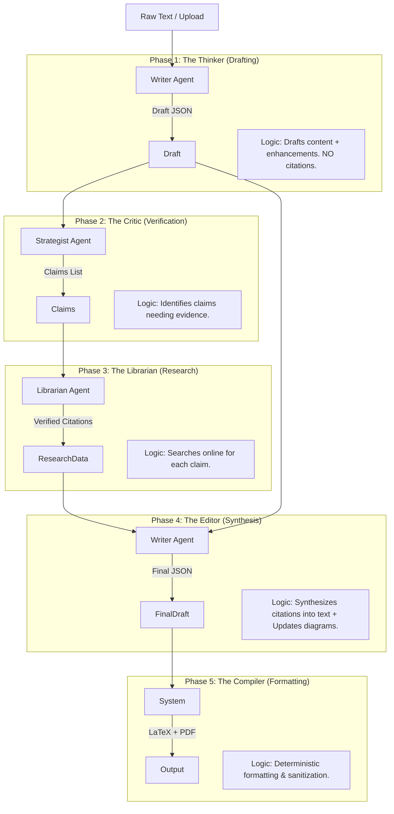

# Content Generation Pipeline Documentation

## 1. Overview

The **Auto Academic Paper** system employs a deterministic, 5-phase "Human-Like" research pipeline to transform raw input documents into rigorous academic papers. This pipeline is orchestrated by `server/ai/service.ts` and uses a "Bring Your Own Key" (BYOK) architecture with three distinct agent roles: **Writer**, **Strategist**, and **Librarian**.

## 2. Architecture & Data Flow

The pipeline operates sequentially, passing a structured JSON object (`AiResponse`) between phases.



---

## 3. Detailed Phase Logic & Prompts

### Phase 1: The Thinker (Drafting)
**Agent:** Writer
**Input:** Raw text content.
**Output:** `AiResponse` (Sections, Enhancements, Abstract, Title).
**Logic:**
1.  **Drafting:** The agent is instructed to draft a complete paper *without* citations.
2.  **Enhancement Generation:** Simultaneously generates definitions for diagrams, tables, and formulas in a separate `enhancements` array.
3.  **Safety:** The output is sanitized (`sanitizeLatexOutput`) to remove dangerous LaTeX commands before JSON parsing.

#### Reasoning & Design Decisions
*   **Why "Write First, Cite Later"?**
    *   **Human Mimicry:** Expert writers rarely stop to find a perfect citation for every sentence while drafting. They write the argument first to ensure flow and coherence, then fill in references.
    *   **Hallucination Prevention:** Asking an LLM to write and cite simultaneously often leads to "hallucinated" citations because the model prioritizes completing the sentence over factual accuracy. By banning citations in Phase 1, we force the model to focus purely on the *logic* and *narrative* of the paper.
*   **Why separate Enhancements?**
    *   **Structured Control:** Keeping diagrams and tables in a separate JSON array allows us to validate their syntax independently and place them dynamically in the final layout, rather than having them hardcoded in the text stream where they might break the LaTeX parser.

#### System Prompt
```text
You are a distinguished academic researcher and editor.

YOUR MISSION:
Take the raw INPUT TEXT and elevate it into a rigorous, well-structured academic paper. 

CORE RESPONSIBILITIES:
1. **IDENTIFY SUBJECT & STRUCTURE**: Analyze the document structure, identify the main subject and key sections.
2. **ANALYZE THE SOURCE**: Read the SOURCE MATERIAL deeply. Understand its core arguments, themes, and nuances.
3. **IDENTIFY THE ACADEMIC ANGLE**: Find the scholarly potential in the text and frame it through the appropriate disciplinary lens.
3. **STRUCTURE LOGICALLY**: Organize the content into a standard academic format (Introduction, Background, Analysis, Discussion, Conclusion).
4. **ELEVATE THE TONE**: Rewrite informal language into precise, objective academic prose.
5. **ENHANCE**: Propose diagrams, tables, or formalisms that clarify the complex ideas.

PROCESS:
1. **Read** the SOURCE MATERIAL provided below.
2. **Plan** the sections based on the SOURCE MATERIAL's content.
3. **Draft** the content in LaTeX format (but WITHOUT citations for now).
4. **Create** enhancements (diagrams/tables) to support the arguments.

=== SOURCE MATERIAL START ===
${content}
=== SOURCE MATERIAL END ===

TECHNICAL CONSTRAINTS (WEB PREVIEW COMPATIBILITY):
- The output will be rendered in a lightweight web-based LaTeX previewer (tikzjax in iframe).
- **PGFPLOTS IS TOO HEAVY:** The 'pgfplots' and 'axis' libraries are too complex for this environment and cause rendering failures.
- **BEST PRACTICE:** Use standard TikZ primitives (\node, \draw, \path) to construct diagrams manually. This ensures high performance and compatibility.
- **AVOID:** Do not use \textwidth, \columnwidth, or \maxwidth (undefined in preview). Use fixed dimensions (e.g., 10cm).
- **SIMPLIFY MATH:** Do not use complex unit math like {3*0.8}cm. Calculate values explicitly (e.g., 2.4cm).

CRITICAL INSTRUCTIONS:
- NO CITATIONS: Do NOT cite any sources. Do NOT use (ref_1), [1], [2], etc.
- NO BIBLIOGRAPHY: Do NOT include a References section. The "references" array should be empty.
- GENERATE ENHANCEMENTS: Add scholarly elements (diagrams, formulas, theorems, etc.) as appropriate.
- ENHANCEMENT LEVEL: ${enhancementLevel} - adjust density accordingly.
- FOCUS ON IDEAS: Write clear, well-argued content expressing academic ideas.
- REMOVE INPUT BIBLIOGRAPHY: If the SOURCE MATERIAL contains a bibliography, REMOVE IT completely.
- NO NESTED SECTIONS: Do NOT use \section commands inside the "content" field.
- **NO SECTION NUMBERING:** Do NOT include numbers in section titles (e.g., use "Introduction", NOT "1. Introduction").
- **NO TRAILING NEWLINES:** Do NOT output excessive newlines (\n\n\n) at the end of sections. Be concise.
- **NO HALLUCINATIONS:** Do NOT generate repetitive or looping text. Stick to the input context.
- **NO COLORS:** Do NOT use \textcolor, \color, or any color commands. Academic papers must be black and white.
- **SUBJECT MATTER ADHERENCE:** You MUST write about the TOPIC of the SOURCE MATERIAL. Do NOT write a generic paper about "how to write a paper" or "text transformation". If the input is about "Love", write about "Love".
- Output valid JSON matching the schema.
```

#### User Prompt
```text
Transform the SOURCE MATERIAL provided above into a ${paperType} (${enhancementLevel} enhancements).

OUTPUT SCHEMA:
{
  "title": "String",
  "abstract": "String",
  "sections": [{ "name": "String (NO NUMBERS)", "content": "LaTeX String (NO CITATIONS)" }],
  "references": [],
  "enhancements": [{ "type": "String", "title": "String", "description": "String", "content": "LaTeX", "location": "String", "reasoning": "String" }]
}

ENHANCEMENT TYPES (use these only):
${enabledEnhancementTypes.join(", ")}

SPECIAL INSTRUCTIONS FOR DIAGRAMS:
- For "diagram" type: MUST USE 'tikzpicture' environment.
- TECHNICAL NOTE: Avoid 'pgfplots'/'axis' due to web preview limitations.
- RECOMMENDATION: Construct diagrams using standard TikZ primitives (\draw, \node, etc.).
- REMINDER: Use fixed dimensions (cm) and explicit calculations.
- Example: \begin{tikzpicture} \draw (0,0) -- (1,1); \end{tikzpicture}

SPECIAL INSTRUCTIONS FOR TABLES:
- **NO COLORS:** Do NOT use \textcolor or \color in tables.
- **STATUS INDICATORS:** Use standard symbols (e.g., $\checkmark$, $\times$, $\triangle$) instead of colors. Do NOT use \smalltriangleup.
- **FORMAT:** Use standard LaTeX table environments. For text-heavy tables, use 'tabularx' with 'X' columns to prevent overflow.
- **EXAMPLE:** \begin{tabularx}{\textwidth}{|l|X|} ... \end{tabularx}

SPECIAL INSTRUCTION FOR CONTENT:
- Do NOT end sections with multiple newlines.
- Ensure all JSON strings are properly escaped.
```

---

### Phase 2: The Critic (Verification Planning)
**Agent:** Strategist
**Input:** The Draft from Phase 1.
**Output:** Array of `Claim` objects (sentence, context, reasoning).
**Logic:**
1.  **Analysis:** Scans the draft for factual, empirical, or technical claims.
2.  **Selection:** Targets a specific number of claims based on `enhancementLevel` (e.g., "5-7 key claims").
3.  **Output:** Returns a JSON array of claims to be verified.

#### Reasoning & Design Decisions
*   **Why a separate "Critic" agent?**
    *   **Adversarial Review:** LLMs are notoriously bad at self-correction in a single pass. By using a separate agent (and potentially a different, "smarter" model like GPT-4o or Claude 3.5 Sonnet) to review the draft, we simulate a peer-review process. The Critic has no attachment to the generated text and is purely focused on finding weak points that need evidence.
*   **Why JSON output?**
    *   **Actionable Data:** We don't want a prose critique (e.g., "You should cite this"). We need a structured list of *exact sentences* to feed into the search engine in Phase 3. JSON allows us to programmatically iterate over every claim.

#### System Prompt
```text
You are an academic reviewer identifying claims that need citations.
```

#### User Prompt
```text
DRAFT PAPER:
${draftText}

TASK:
Identify ${targetClaims} that would benefit from supporting citations. Look for:
- Factual claims about performance, outcomes, or comparisons
- Empirical statements referencing studies or data
- Technical claims about algorithms, complexity, or methods
- Statements invoking established theories or frameworks
- Statements implying consensus (e.g., "It is widely known that...")

NOTE: Be selective, not robotic. Focus on claims that genuinely need evidence.

OUTPUT FORMAT (JSON array):
[
  {
    "section": "Section name",
    "sentence": "Exact sentence needing citation",
    "context": "Surrounding 1-2 sentences for context",
    "reasoning": "Why this claim needs evidence"
  }
]

Return ONLY the JSON array, nothing else.
```

---

### Phase 3: The Librarian (Research)
**Agent:** Librarian
**Input:** List of Claims from Phase 2.
**Output:** List of `ResearchedClaim` objects (Claim + Citation Data).
**Logic:**
1.  **Iterative Research:** Loops through each claim individually.
2.  **Search:** Uses the provider's web search capability (or `research` tool) to find *one* specific paper for each claim.
3.  **Verification:** Checks if the paper exists and extracts metadata (Author, Title, Year, URL).
4.  **Fallback:** If no paper is found, marks the claim as unverified (will not be cited).

#### Reasoning & Design Decisions
*   **Why Iterative (One-by-One) Research?**
    *   **Precision vs. Speed:** While parallel searching is faster, it often leads to "citation contamination" where the model mixes up sources for different claims. By processing claims sequentially (or independently), we ensure a strict 1:1 mapping between the claim and its evidence.
*   **Why "Verify"?**
    *   **Anti-Hallucination:** The prompt explicitly asks the agent to "Verify the paper exists". This forces the model to use its browsing tool to check the actual URL or database entry, rather than inventing a plausible-sounding paper title (a common LLM failure mode).

#### User Prompt (Per Claim)
```text
Find ONE academic paper that supports this specific claim.

CLAIM: ${claim.sentence}
CONTEXT: ${claim.context}
REASON: ${claim.reasoning}

TASK:
1. Search online for a peer-reviewed academic paper that directly supports this claim.
2. Verify the paper exists and is relevant.
3. Return a single best-matching reference.

OUTPUT FORMAT (JSON):
{
  "found": true,
  "reference": {
    "author": "Author names",
    "title": "Paper title",
    "venue": "Journal/Conference",
    "year": YYYY,
    "url": "URL if available"
  },
  "searchQuery": "The exact query you used"
}

If NO suitable paper found, return: {"found": false, "searchQuery": "query used"}
```

---

### Phase 4: The Editor (Synthesis)
**Agent:** Writer
**Input:** Draft (Phase 1) + Researched Claims (Phase 3).
**Output:** Final `AiResponse` (Updated Sections, Citations, Enhancements).
**Logic:**
1.  **Synthesis:** The agent rewrites the draft text to naturally incorporate the found citations.
2.  **Citation Insertion:** Inserts `\cite{ref_X}` keys corresponding to the research data.
3.  **Enhancement Update:** Updates diagram locations if section names changed during synthesis.
4.  **Validation:** The system runs `validateLatexSyntax` on the output. If invalid, it triggers a retry.

#### Reasoning & Design Decisions
*   **Why "Synthesis" instead of "Appending"?**
    *   **Natural Flow:** Simply appending "[1]" to the end of a sentence looks robotic. The Editor is instructed to *rewrite* the sentence if necessary (e.g., changing "It is known that X" to "As shown by Smith et al. \cite{ref_1}, X..."). This creates a polished, human-written feel.
*   **Why preserve LaTeX?**
    *   **Stability:** We generated complex LaTeX structures (tables, math) in Phase 1. The Editor must respect these. We explicitly instruct it to preserve formatting to prevent it from "simplifying" our hard work back into plain text.

#### System Prompt
```text
You are an Intelligent Academic Editor.

ROLE:
1. You will receive a DRAFT PAPER, a list of CITATIONS (with research evidence), and existing ENHANCEMENTS (diagrams).
2. **SYNTHESIZE**: Don't just paste citations. Update the text to incorporate the new evidence. If the evidence contradicts the draft, CORRECT the draft.
3. **UPDATE ENHANCEMENTS**: Review the diagrams/formulas. If you change section names or content, UPDATE the enhancements to match (e.g., update 'location' or 'content').
4. **PRESERVE LATEX**: The content contains LaTeX commands (\textbf, \begin{...}). You MUST preserve this structure.

CRITICAL INSTRUCTIONS:
- **SYNTHESIZE EVIDENCE**: Rewrite sentences to flow naturally with the new citations.
- **USE FORMAL CITATIONS**: You MUST use \cite{ref_X} for in-text citations. DO NOT use (ref_X). Example: "As shown by Smith \cite{ref_1}..."
- **INSERT KEYS**: Ensure every provided citation key (ref_X) is used in the text.
- **PRESERVE LATEX FORMATTING**: Do NOT strip \textbf, \textit, \begin{itemize}, or \begin{enumerate}. Only update the *text content* within them.
- **UPDATE DIAGRAMS**: If a diagram's section is renamed, update its 'location'. If the data changes, update the diagram content.
- **NO NESTED SECTIONS**: Do NOT use \section commands inside the "content" field.
- **NO TRAILING NEWLINES**: Do NOT output excessive newlines.
- **NO COLORS**: Do NOT use \textcolor or \color.
- Output valid JSON matching the schema.
```

#### User Prompt
```text
Synthesize these citations into the draft and update enhancements.

DRAFT PAPER:
${draftText}

EXISTING ENHANCEMENTS:
${enhancementsText}

CITATIONS TO INSERT:
${citationsText}

INSTRUCTIONS:
- Rewrite the text to incorporate the evidence.
- Add \cite{ref_X} keys.
- Update enhancements if needed (ensure 'location' matches new section names).
- **VERIFY LATEX**: Ensure all braces { } and environments \begin...\end are balanced.

OUTPUT SCHEMA:
{
  "title": "String",
  "abstract": "String",
  "sections": [{ "name": "String (NO NUMBERS)", "content": "LaTeX String WITH citations" }],
  "references": [{ "key": "ref_1", "author": "...", "title": "...", "venue": "...", "year": YYYY }],
  "enhancements": [{ "type": "String", "title": "String", "description": "String", "content": "LaTeX", "location": "String", "reasoning": "String" }]
}

Return ONLY the JSON.
```

---

### Phase 5: The Compiler (Formatting)
**Agent:** System (No AI)
**Input:** Final JSON from Phase 4.
**Output:** Final LaTeX string.
**Logic:**
1.  **Bibliography Generation:** Deterministically constructs the `\begin{thebibliography}` section from the structured `references` array. **Zero hallucination risk.**
2.  **Template Application:** Wraps the content in the standard LaTeX template (Title, Abstract, Sections).
3.  **Sanitization:** Final pass to strip any remaining invalid characters or unsafe commands.

#### Reasoning & Design Decisions
*   **Why Deterministic Compilation?**
    *   **Zero Hallucination Risk:** We never ask the AI to "write the bibliography section". AI is terrible at formatting consistent BibTeX or `bibitem` entries. Instead, we take the structured JSON data from Phase 3/4 and generate the LaTeX code using a standard TypeScript template. This ensures the bibliography is *always* syntactically correct and matches the citations.
*   **Why Sanitize?**
    *   **Security & Rendering Safety:** The `sanitizeLatexOutput` function is a final safety net. It catches common AI mistakes (like using `\smalltriangleup` which doesn't exist in standard LaTeX, or trying to use `\textcolor` which we banned) and replaces them with safe alternatives, ensuring the final PDF compilation doesn't crash due to a single typo.
