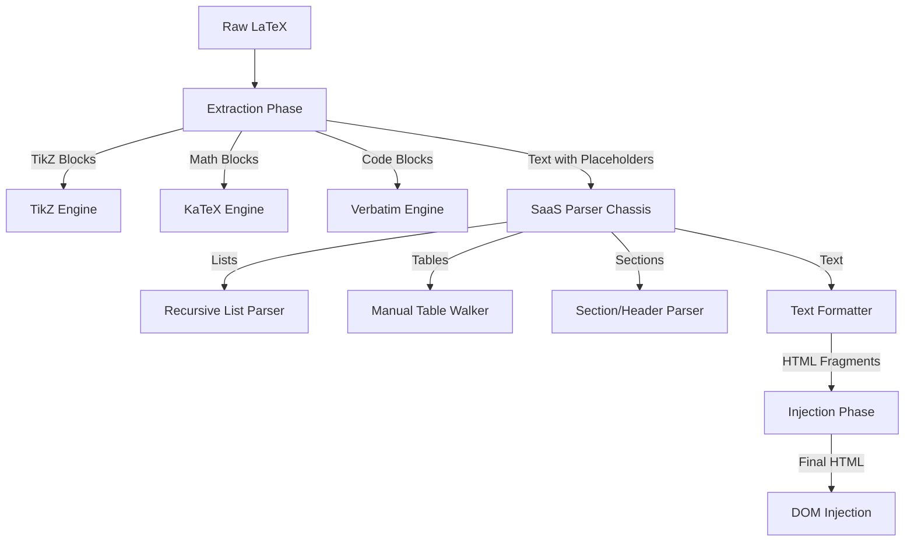

# Custom LaTeX Preview Architecture ("The Nuclear Option")

The browser-based preview system uses a **Fully Custom TypeScript Parser** (`latex-to-html.ts`) to render academic documents. We have **abandoned `latex.js` entirely** in favor of a robust, fault-tolerant "SaaS" (Software as a Service) parser chassis that integrates our battle-tested custom rendering engines.

## The Pivot: Why We Nuked `latex.js`

We previously used a "Hybrid" architecture where we tried to sanitize input for `latex.js`. It failed because:

1. **Fragility**: A single unknown macro caused a whitespace-of-death crash.
2. **Black Box**: We couldn't control how it handled lists or tables (hence the "1Text" bugs).
3. **Containment Costs**: We spent 90% of our time writing code to *prevent* `latex.js` from seeing code.

**The Solution:** We built our own "Dumb but Robust" parser.

- **Philosophy**: "Show Something." If a command is unknown, ignored it or show raw text. Never crash.
- **Control**: We own every pixel of the output.

---

## 1. The Architecture: Chassis + Engines

The transformation pipeline (`convertLatexToHtml`) operates in a single synchronous pass:

### 1.1 The "SaaS" Chassis

The core parser operates on a simple principle: **Recursive Environment Parsing**.

- It scans for `\begin{env} ... \end{env}`.
- It identifies well-known environments (`itemize`, `tabular`, `abstract`) and dispatches them to specialized engines.
- It handles standard commands (`\section`, `\textbf`) via regex replacement.
- **Fault Tolerance**: Unknown commands `\foo{bar}` are either stripped to `bar` or ignored, preventing crashes.

---

## 2. The Extraction Phase (The "Safe Zone")

Before we touch the text string, we extract complex elements that would confuse a text parser.

### 2.1 TikZ Diagrams (The "Intent Engine")

**Engine**: `renderTikz` (Custom Iframe Generator)
TikZ code is technically a programming language. We cannot parse it; we only isolate it.

- **Extraction**: Captures `\begin{tikzpicture}...\end{tikzpicture}`.
- **Processing**:
  - **Intent Classification**: Analyzes `node distance`, text density, and coordinate span.
    - **WIDE**: Horizontal span > 14cm. Scales to fit A4.
    - **FLAT**: Aspect ratio > 3:1. Boosting Y-axis for timelines.
    - **LARGE**: Dense cycles. Increases spacing (Node Dist 8.4cm).
    - **COMPACT**: Simple pipelines. Scales down (0.75x).
  - **Rendering**: Generates an `<iframe>` payload with a full HTML document loading **TikZJax**.
  - **Isolation**: The iframe prevents CSS pollution and script conflicts.

### 2.2 Math (KaTeX)

**Engine**: `renderMath` (KaTeX Wrapper)

- **Extraction Order**:
  1. Structured Envs (`align`, `equation`) -> Preserves newlines `\\`.
  2. Display Math (`\[...\]`).
  3. Inline Math (`$...$`, `\(...\)`).
- **Sanitization**: We use a **Universal Regex** to fix orphaned subscripts (`$\theta$_t` -> `$\theta_t$`) before rendering.
- **Scaling**: Large equations are auto-classified ("Too Wide") and wrapped in scaling CSS containers to preventing horizontal scrolling.

### 2.3 Code Blocks

**Engine**: `renderVerbatim`

- **Extraction**: `verbatim`, `lstlisting`.
- **Safety**: Manually HTML-escapes content (`<` -> `&lt;`) to prevent XSS.
- **Styling**: Wraps in `<pre class="algorithm-wrapper">` for consistent "gray box" academic look.

---

## 3. The Structural Parsing Phase

Once "Safe Placeholders" (`__HTML_BLOCK_N__`) are in place, we process the document structure.

### 3.1 Lists (Recursive Parser)

**Engine**: `processLists` (Manual Character Walker)
We do not use regex for lists because of nesting (`itemize` inside `enumerate`).

- **Strategy**: "Leaf-First" Recursion.
  - Finds the deepest `\begin{list}` that contains no other lists.
  - Parses items using a State Machine (handles `\item[Label]`).
  - Converts to HTML `<ol>`/`ul`.
  - Replaces with a placeholder and repeats until no lists remain.
- **Fixes**: Solves the `latex.js` "1Text" bug and the whitespace drift.

### 3.2 Tables (The "Scorched Earth" Walker)

**Engine**: `processTable` (Manual Character Walker)
We support `tabular`, `tabularx`, and `booktabs`.

- **Argument Parsing**: Manually parses `{l c r}` and `{|p{3cm}|}` specifications using brace counting.
- **Row Splitting**: `smartSplitRows` function iterates char-by-char to find `\\` that are NOT inside braces or escaped.
- **Cell Splitting**: `splitCells` function finds `&` that are NOT escaped (`\&`).
- **Robustness**: Handles `\multicolumn`, `\multirow`, and `\hline` (converted to CSS borders).

### 3.3 Sections & Metadata

- **Headers**: `\section`, `\subsection` mapped to `<h2>`, `<h3>` with academic numbering logic.
- **Abstract**: `\begin{abstract}` mapped to a styled `
` with centered bold title.
- **Title/Author**: Parsed from `\title{}` and `\author{}` commands and injected into a specialized "Paper Header" block.

---

## 4. Text Formatting (Context-Aware)

The final pass handles the prose.

### 4.1 The "Structural Underscore" Fix

We do **not** globally replace `_` with `\_`.

- **Logic**: The `parseLatexFormatting` function scans for underscores.
- **Math Safety**: It checks if the underscore is inside a math placeholder (`__HTML_BLOCK_N__`).
  - If Yes: Leave it alone (KaTeX needs it).
  - If No: Escape it (`_` -> `_`) to prevent italic rendering or corruption.

### 4.2 Typography

- **Bold/Italic**: regex replacement for `\textbf`, `\textit`, `\emph`.
- **Citations**: `\cite{ref_X}` mapped to `[1, 2]` using the **Universal Citation Processor** (see Section 23 of old docs).
- **References**: `\ref{fig:x}` parsed to `[?]` (or resolved if simple number).

---

## 5. CSS Architecture (`latex-article.css`)

The look and feel are driven by a single "Truth" stylesheet.

- **Paper Simulation**: `.latex-preview` container has `min-height: 297mm`, `padding: 25mm`, and `background: white`.
- **Fonts**: 'Lora' (Serif) for body, 'Inter' (Sans) for UI.
- **Reset Override**: Aggressive `!important` usage to defeat Tailwind's preflight resets (restoring `OL`/`UL` bullets and numbers).

---

## 6. Security (XSS Prevention)

Since we are writing a parser, we are responsible for sanitization.

1. **Strict Output**: The parser only generates specific HTML tags (`
`, ``, `<table>`, `<h1>`...).
2. **Escaping**: All variable text content (table cells, list items) runs through `escapeHtml()` before concatenation.
3. **Isolation**: User-generated logic (TikZ) runs in sandboxed iframes.

---

## Summary of Capabilities

| Feature       | Old System (`latex.js`)    | New System (`latex-to-html.ts`)            |
| ------------- | -------------------------- | ------------------------------------------ |
| **Stability** | Crashes on 1 unknown macro | **100% Fault Tolerant** (Ignores unknowns) |
| **Math**      | Fragile Extraction         | **Robust Extraction** + Universal Fixes    |
| **TikZ**      | Supported (Hybrid)         | **Supported (Native)** + Intent Engine     |
| **Tables**    | Manual Patching            | **Native Manual Walker** (Refined)         |
| **Lists**     | Broken ("1Text")           | **Perfect Recursive Rendering**            |
| **Speed**     | Slow (JS Parsing)          | **Instant** (Regex/String Ops)             |
